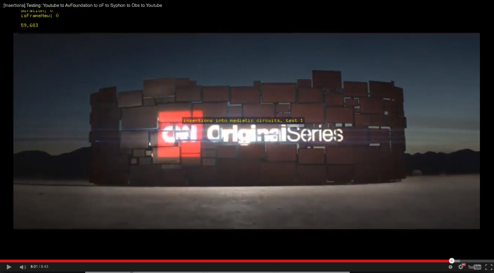

# Capture and backstream
Here, I cover research on:
1. **Efficient capturing**: How to efficiently capture a TV video and manipulate it via code?
2. **Efficient backstream**: How to efficiently stream the manipulated video back to the internet/Raspberry PI?

In the end, I was able to get good video and audio quality in oF OS X. The full pipeline is:

```
Input stream > ofxAvFoundationHLSPlayer > oF > ofxSyphon & Soundflower > Open broadcast software > Output stream
```

The result is available in:

[](https://www.youtube.com/watch?v=6U-RkUvGAas "VIDEO1")

The research explaining what I've tested to get to this result is presented below.

## Efficient capturing
We need to be able to capture [m3u](https://en.wikipedia.org/wiki/M3U) files used by [HLS](https://tools.ietf.org/html/draft-pantos-http-live-streaming-20) and import it as a regular video into code. M3u is used both by youtube live and by Suntek's streamserver. Apple's [AvFoundation](https://en.wikipedia.org/wiki/AVFoundation) seems able to play m3u8 files.

A m3u sample file (that you can also open in VLC or Quicktime):
```
ffplay http://devimages.apple.com/iphone/samples/bipbop/bipbopall.m3u8
```

Tried to read these files in oF's native ofVideoPlayer with no success. Posted a question here:

https://forum.openframeworks.cc/t/hls-m3u8-http-live-streaming-video/11927

This seems to be an old and recurrent unsolved problem. See for example these threads:
- https://github.com/openframeworks/openFrameworks/issues/1741
- https://github.com/openframeworks/openFrameworks/issues/4662
- https://forum.openframeworks.cc/t/ofvideoplayer-load-and-loadmovie-problems-when-streaming/21636/8

There are two paths to test. Using *ofxGStreamer* and using *ofxAvFoundationHLSPlayer*. I was successful using the later. The former is a potential path to support other platforms (e.g. windows, and linux).

### ofxAvFoundationHLSPlayer
This is the solution I've found!
https://github.com/jvcleave/ofxAvFoundationHLSPlayer

It is possible to get a higher quality link from youtube-dl by using -f parameter. For example:
```
youtube-dl -f 95 -g https://www.youtube.com/watch?v=6Te20A6b1Ac
```

To test the quality before feeding it to oF, you can use:
```
ffplay https://manifest.googlevideo.com/api/manifest/hls_playlist/id/6Te20A6b1Ac.1/itag/95/source/yt_live_broadcast/requiressl/yes/ratebypass/yes/live/1/cmbypass/yes/goi/160/sgoap/gir%3Dyes%3Bitag%3D140/sgovp/gir%3Dyes%3Bitag%3D136/hls_chunk_host/r1---sn-cxaaj5o5q5-t0as.googlevideo.com/ei/FQDoWIHjF5T_7gSIi46ICA/gcr/ca/playlist_type/LIVE/mm/32/mn/sn-cxaaj5o5q5-t0as/ms/lv/mv/m/pl/22/dover/6/upn/pyw5RWEuy1s/mt/1491599289/ip/69.159.141.0/ipbits/0/expire/1491620980/sparams/ip,ipbits,expire,id,itag,source,requiressl,ratebypass,live,cmbypass,goi,sgoap,sgovp,hls_chunk_host,ei,gcr,playlist_type,mm,mn,ms,mv,pl/signature/47B407539558666D3453970D3B902E5D9A839114.1C1F737E617667A8E79416CF250376199F37DC69/key/dg_yt0/playlist/index.m3u8
```

### Untested or not working
These are the alternatives I've considered to test. Some of them remais untested. Some others I've faced problems.

#### ofxVideoPipe
Remains untested. This alternative relates to create a pipe via ffmpeg directly to openframeworks. Maybe this addon could help on this:
https://github.com/heisters/ofxVideoPipe

#### [PROBLEM] ofxGStreamer
It seems that some videos libs [ofGStreamer](https://github.com/arturoc/ofxGStreamer) might be able to handle this. See:

https://github.com/openframeworks/openFrameworks/issues/5308

After [Arturo's help](https://forum.openframeworks.cc/t/playback-from-an-rtsp-stream-of-0-9-8-windows-64bit/25326/9), I was able to compile the library. However, loading m3u8 did not work for me. To be tested in other operating systems.

#### [PROBLEM] Baldtrump
Ben Snell used the black magic device for the capture. His result was awesome!

https://github.com/bensnell/samson

His code used Kyle McDonald’s add-on ofxBlackmagic:

https://github.com/kylemcdonald/ofxBlackmagic

Problem: Need to buy this device that costs around 181 dollars.  :(

#### [PROBLEM] ofxStreamer
This was the first option I tried:

https://github.com/HalfdanJ/ofxStreamer

The library seems a bit outdated. It took me a while to be able to run the examples (about this, if you ever try this path again, remember to include CoreFoundation.framework, CoreVideo.framework, and VideoDecodeAcceleration.framework inside your project, so that compilation works).

Now I'm facing problems in properly encoding the video using ofxStreamerSender.

The problem seems to be in function:
```
bool ofxStreamerSender::sendFrame(unsigned char *data, int data_length);
```

I particular, in the line...
```
//Convert to YUV format
sws_scale(imgctx, (const uint8_t* const*) &data, &stride, 0, height, frame->data, frame->linesize);
```
If the line above is uncommented, the system compiles all right, but it crashes after a few seconds.

If I comment this line, the system does not crashes, but: (a) I get the warning: "[warning] No encoded frame to send, make sure to call encodeFrame"; and (b) Data seems to be received by the receiver, but all I get is a green screen.

This seems to be a bug in ofxStreamer. Just found details in this link:

https://github.com/HalfdanJ/ofxStreamer/issues/2?_pjax=%23js-repo-pjax-container

#### [PROBLEM] ofxIPVideoGrabber

Link: https://github.com/bakercp/ofxIPVideoGrabber

Not really what we're looking for, made for IP cameras.

#### [PROBLEM] ofxVLCVideoPlayer

Link: https://github.com/jnakanojp/ofxVLCVideoPlayer

Seems to work only with local files, and not with networked video streams. At least in theory, supporting networked streams could be possible by using [libvlc](https://wiki.videolan.org/LibVLC). However, this would require studying libvlc.... :(

#### Others
Potentially useful links:
- https://github.com/arturoc/ofxGstV4L2Sink (linux only?)
- https://github.com/jvcleave/ofxOMXPlayer (processing needs to be done in the raspberry pi?)
- https://github.com/chrippa/livestreamer

<!--
These options are so far outdated:
- http://stackoverflow.com/questions/21081867/ffplay-openframeworks-ar-parrot-drone-tcp-video
- https://github.com/arturoc/ofxGSTRTP
-->


## Efficient backstream
We need to be able to capture the video processed inside oF and stream it back either to Youtube Live or an Raspberry pi.

#### Syphon + OBS + Soundflower
This is the best solution I have so far. Unfortunately, it's OS X only... :(

The combination [Syphon](http://www.syphon.v002.info/) + [OBS](http://obsproject.com/) + [Soundflower](https://soundflower.en.softonic.com/mac) seems versatile inside OS X and allows the stream to be sent to Youtube Live, RTPS (e.g. Raspberry pi), Facebook live, etc. Syphon is brought to oF via [ofxSyphon](https://github.com/astellato/ofxSyphon). Seems costly and heavy, but is actually the one that worked better.

The idea is similar to Ben Snell's approach and is roughly described in this link:

http://doktor-andy.de/wordpress/?p=1768

### Untested or not working
These are the alternatives I've considered to test. Some of them are untested. Some others I've faced problems.

#### FFmpeg
It's always possible to use FFmpeg screen capture to do the job. This was the approach was the one I was using before, and seems reliable and multiplatform. For example:

To stream for a local raspberry pi, all you need is:
```
ffmpeg -f avfoundation -pixel_format yuv420p -r 30 -i "1:1" -vcodec libx264 -preset veryfast -tune zerolatency -bsf:v h264_mp4toannexb -b:v 5000k -bufsize 500k -f mpegts udp://RASPBERRY_IP_:8888
```

To file:
```
ffmpeg -f avfoundation -r 30 -i "1:1" -acodec libmp3lame -ar 44100 -b:a 128k -vcodec libx264 -preset veryfast -s 1280x720 -tune zerolatency -bsf:v h264_mp4toannexb -b:v 5000k -bufsize 400k out.mp4
```

To Youtube live:
```
ffmpeg -f avfoundation -r 30 -i "1:1" -acodec libmp3lame -ar 44100 -b:a 128k -vcodec libx264 -pix_fmt yuv420p -profile:v baseline -preset ultrafast -s 1280x720 -bsf:v h264_mp4toannexb -b:v 5000k -bufsize 400k -f flv rtmp://a.rtmp.youtube.com/live2/ID
```

If you want to have more info on effective enconding for streaming in FFmpeg, check [here](https://trac.ffmpeg.org/wiki/Encode/H.264) and [here](https://trac.ffmpeg.org/wiki/Capture/Desktop).

However, in OS X, I'm struggling with two problems:

1. Reaching good audiovisual quality; and

2. Grabbing screen coordinates (something similar to what x11grab does on Linux).

#### [PROBLEM] ofxGStreamer
It seems that some videos libs [ofGStreamer](https://github.com/arturoc/ofxGStreamer) might be able to handle this.

This solution would be ideal because it could potentially allow capture and backstream.

After a while I was able to install this. However, it didn't work as expected. Doesn't seem capable to stream content to youtube.

#### [PROBLEM] Baldtrump
Ben Snell used Syphon to stream from the manipulated video from oF to youtube. The result was again awesome!

https://github.com/bensnell/samson

The problem this case is that Syphon works only in OSX... :(
