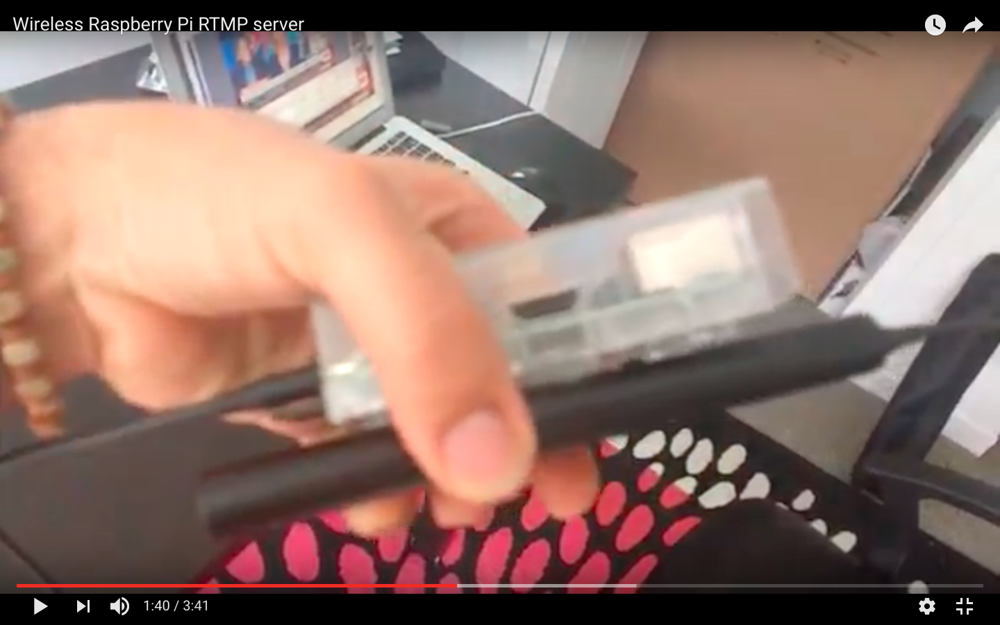

# Wireless Raspberry Pi RTMP server
These are the steps I've followed to set up the wireless RTMP server for the Raspberry Pi (RPi). This server allows us to receive video streams from the OBS server inside an small autonomous RPi. As follows:

[](https://www.youtube.com/watch?v=zVjokllyfbM&feature=youtu.be "VIDEO1")

## SSHing the Raspberry Pi
First we need to be able to use the RPi.

In case you don't have neither keyboard, mouse, nor monitor, that's what you'll need:
1. Plug it via ethernet cable to the router;
2. Access the router configuration and grab the raspberry p ip on the network (you can always use `arp -a` or `arp-scan` instead);
3. Use SSH to connect to the raspberry pi by:
```
ssh pi@192.168.2.24
```

4. Put the password (if asked). The RPi default is `raspberry`.

For a complete guide on this, check [this tutorial](https://www.raspberrypi.org/documentation/remote-access/ssh/unix.md).

## Configuring the wifi
Second thing, we need to configure the RPi and the wifi adaptor (I use something similar to [this one](http://www.gearbest.com/raspberry-pi/pp_413677.html?currency=CAD&vip=989008&gclid=CLf9j-O6x9MCFUm2wAodf1IEGg)) to our local network.

1. For scanning networks, you'll need:
```
sudo iwlist wlan0 scan
```
2. Open the `wpa-supplicant` configuration file by:
```
sudo nano /etc/wpa_supplicant/wpa_supplicant.conf
```

3. In the end of the file, you'll be able to your the network SSID and the password, as follows:
```

network={
    ssid="The_ESSID_from_earlier"
    psk="Your_wifi_password"
}
```

4. Restart the interface by:
```
sudo wpa_cli reconfigure
```

5. You can test if your setup works by unplugging the ethernet cable, restarting the RPi, and repeating the section "Connecting to the Raspberry Pi", but looking the Ip address of the wireless RPi instead.

This section is directly taken from [this complete tutorial](https://www.raspberrypi.org/documentation/configuration/wireless/wireless-cli.md).

## Setting up the RTMP server
Here we need to set up a RTMP server to listen to the incoming data from OBS. For this, we will use [nginx](http://nginx.org/en/download.html) and a [nginx RTMP module](https://github.com/arut/nginx-rtmp-module/).

Just a quick side comment: When starting this step, I faced some problems related to an invalid repository source ([here](https://www.raspberrypi.org/forums/viewtopic.php?f=28&t=123260) for details). Repository address updated, problem solved. ;)

1. Install dependencies as follows:
```
sudo apt-get install build-essential libpcre3 libpcre3-dev libssl-dev
```

2. Download and install nginx and its RTMP module (it can take sometime):
```bash
#creates a folder
mkdir rtmp-server
#moves to this new folder
cd rtmp-server
#downloads nginx
wget http://nginx.org/download/nginx-1.12.0.tar.gz
#donwloads nginx rtmp module
wget https://github.com/arut/nginx-rtmp-module/archive/master.zip
#unzips the nginx and the module
tar -zxvf nginx-1.12.0.tar.gz
unzip master.zip
#removes the compressed files
rm nginx-1.12.0.tar.gz
rm master.zip
#moves to the main nginx folder
cd nginx-1.12.0/
#configures and installs
./configure --with-http_ssl_module --add-module=../nginx-rtmp-module-master
make
sudo make install
```

Remember to update nginx version to the most recent and stable one.

3. Open the following file by:
```
sudo nano /usr/local/nginx/conf/nginx.conf
```

And add the following configuration to its end:
```
rtmp {
        server {
                listen 1935;
                chunk_size 4096;

                application live {
                        live on;
            exec_push omxplayer --live rtmp://localhost:1935/live/stream;
                        record off;
                }
        }
}
```

4. Start nginx by:
```bash
sudo /usr/local/nginx/sbin/nginx -s stop
sudo /usr/local/nginx/sbin/nginx
```

5. You can test if everything is working by [starting a stream in OBS](https://github.com/jeraman/insertions/tree/master/osx) with the following setup:
```
Streaming Service: Custom
Server: rtmp://<your server ip>/live
Play Path/Stream Key: stream
```

After that, you only need to initialize omxplayer by:
```
omxplayer --live rtmp://localhost:1935/live/stream
```

And you should be good to go!

See [this tutorial](https://www.raspberrypi.org/forums/viewtopic.php?t=89605) and [this other one](https://obsproject.com/forum/resources/how-to-set-up-your-own-private-rtmp-server-using-nginx.50/) for further detailed info on nginx and RTMP.

### Automatizing
The only thing missing for the RTMP server is to automate the initialization of nginx (at boot time) and to constantly make the RPi to check for new streams in the omxplayer. For this, we can create a script called `rtmp-server` inside `/etc/init.d/`:
```
sudo touch /etc/init.d/rtmp-server
```

Open this file by:
```
sudo nano /etc/init.d/rtmp-server
```

And put this script inside the file:
```bash
#! /bin/sh
# /etc/init.d/rtmp-server
sudo /usr/local/nginx/sbin/nginx -s stop
sudo /usr/local/nginx/sbin/nginx
while [ 1 ]
do
    omxplayer --live rtmp://localhost:1935/live/stream
    sleep 5
done
```

Finally, make the script executable and register it to run at startup by:
```
sudo chmod 755 /etc/init.d/rtmp-server
sudo update-rc.d rtmp-server defaults
```

More info custom initialization scripts in RPi can be found [here](http://www.stuffaboutcode.com/2012/06/raspberry-pi-run-program-at-start-up.html).

## Pluging Raspebrry Pi into the target
And that's it! In my case, I've done in an old video projector I have at home via RCA and speakers. ;)

--

jeraman.info, 2017
