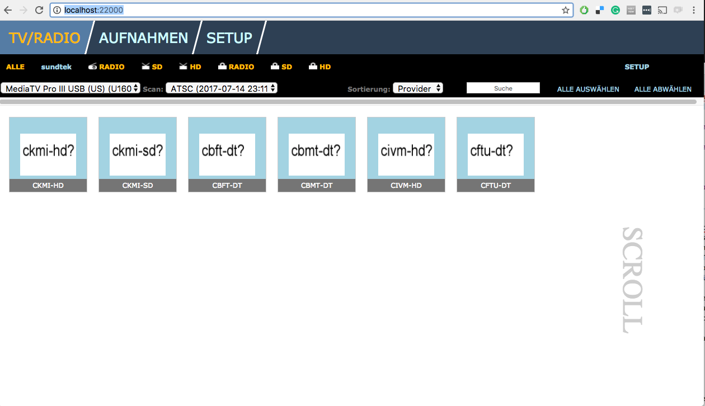
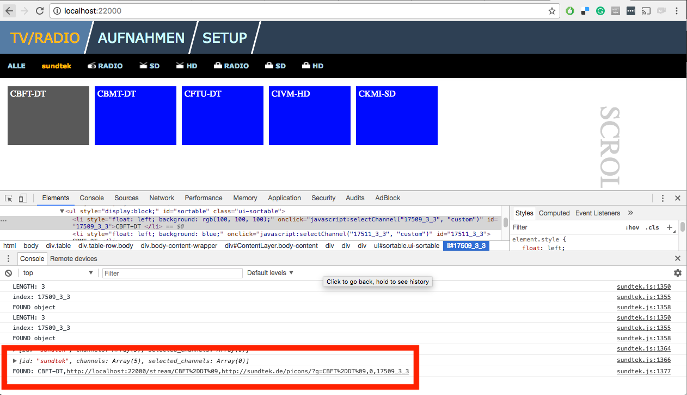
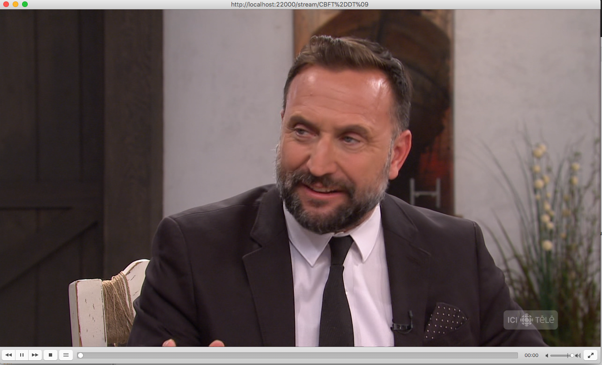

# Playing Sundtek on computer

This textfile documents how to play HD TV on my OS X computer using the Sundtek device.

## Pluging the Hardware In
In short:
```
HD Antenna >  Sundtek ATSC >  Computer USB.
```

If the drivers are properly installed (ie. watch [this video](https://www.youtube.com/watch?v=o7K6hIPoaSc) or seek help on Sundtek support forum), you can check if the computer can see your hardware. First login as root. Then:

```bash
cd /opt/bin
sudo ./mediaclient --start
./mediaclient -e
```

And you should see your device as below:
```bash
**** List of Media Hardware Devices ****
device 0: [MediaTV Pro III USB (US)]  ATSC, ANALOG-TV, FM-RADIO, REMOTE-CONTROL, OSS-AUDIO, RDS
  [INFO]:
     STATUS: ACTIVE
  [BUS]:
     ID: 0-0x1d113000
  [SERIAL]:
     ID: U160714200332
  [ATSC]:
     FRONTEND: /dev/dvb/adapter0/frontend0
     DVR: /dev/dvb/adapter0/dvr0
     DMX: /dev/dvb/adapter0/demux0
  [ANALOG-TV]:
     VIDEO0: /dev/video0
     VBI0: /dev/vbi0
  [FM-RADIO]:
     RADIO0: /dev/radio0
     RDS: /dev/rds0
  [REMOTECONTROL]:
     INPUT0: /dev/mediainput0
  [OSS]:
     OSS0: /dev/dsp0
```

## Testing the Media server
Open the media server in your browser:
```
http://localhost:22000/
```

If you device is already setup (ie. watch [this video](https://www.youtube.com/watch?v=sEnB6PGZHVw) or seek help on Sundtek's support forum), you should be able to see the channels available in your area as in the picture below:

[]

We need to find the link correspondent to the channel you want to use. In my case, that's how I did it:
  1. Click on 'sundtek' menu. You should be able to see all the channels again;
  2. Right click on one channels and click on 'Inspect';
  3. Still inside the media server, double click on the channel you want to watch;
  4. The link for the channel should show up on your inspector (see image below).

[]

You can note that there are two links in this link. The first one is what you're looking for. Something like:
```
http://localhost:22000/stream/CBFT%2DDT%09
```

Now, the final step is to open this link using [VLC](https://www.videolan.org/). If you don't have VLC, download it. You can load the link under:
```
File > Open Network > URL:
```

That should be it, as you can see below:

[]
