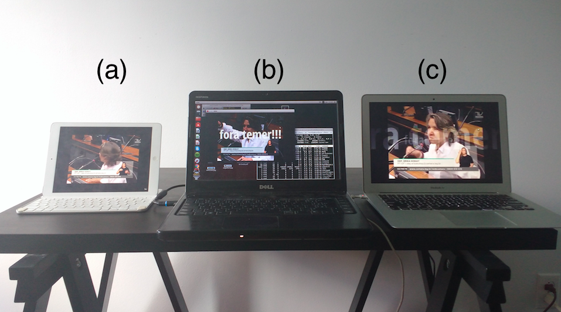
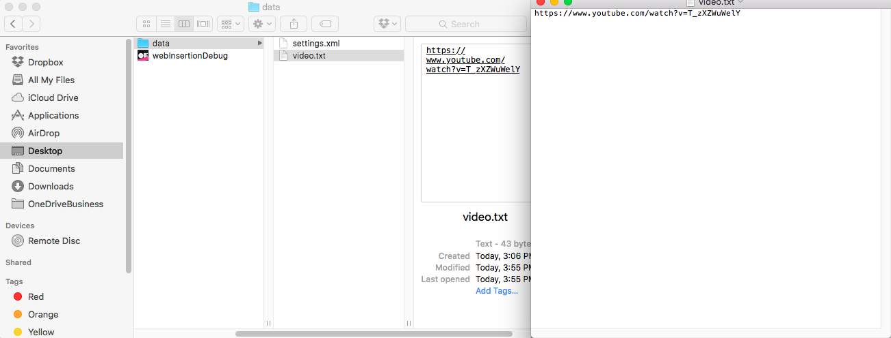
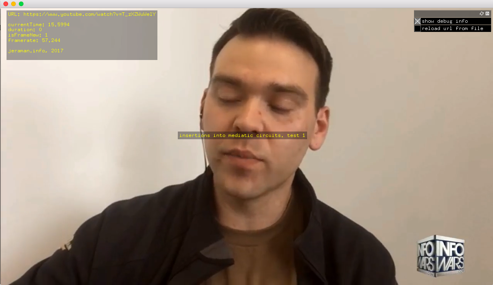
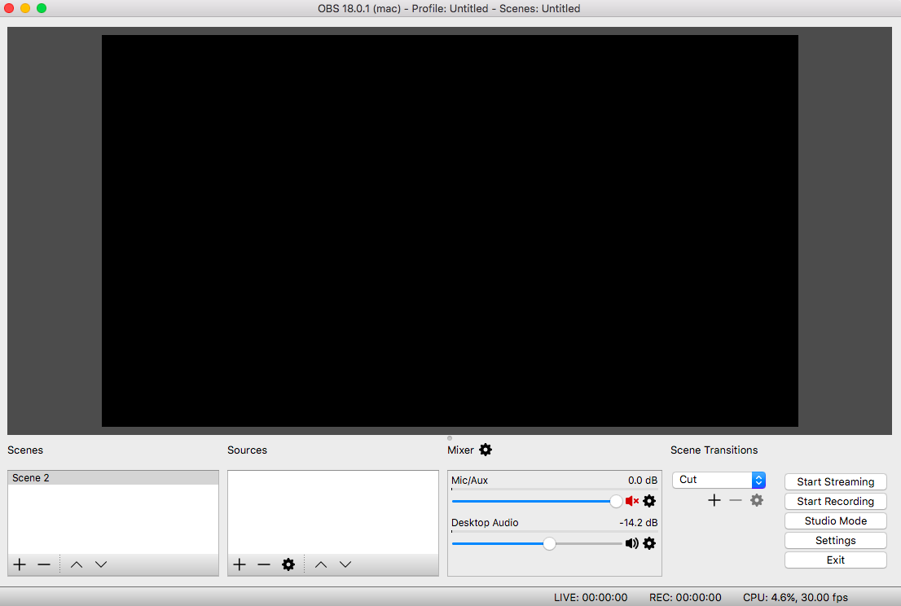
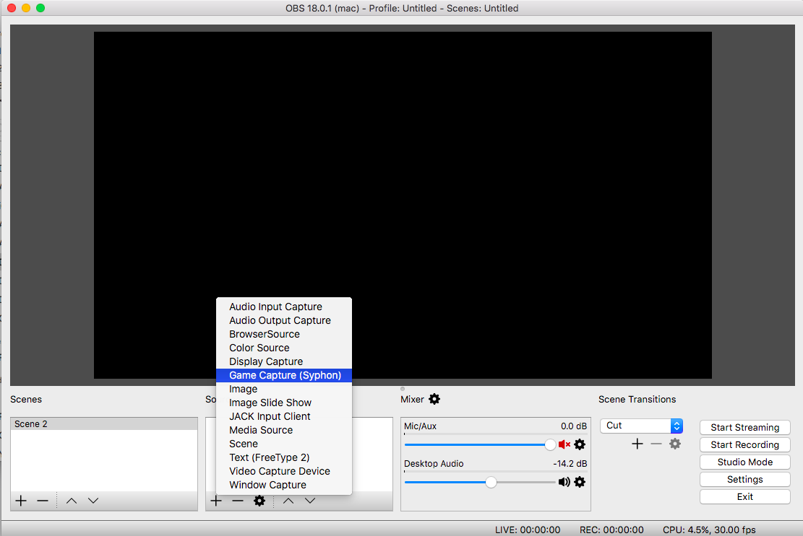
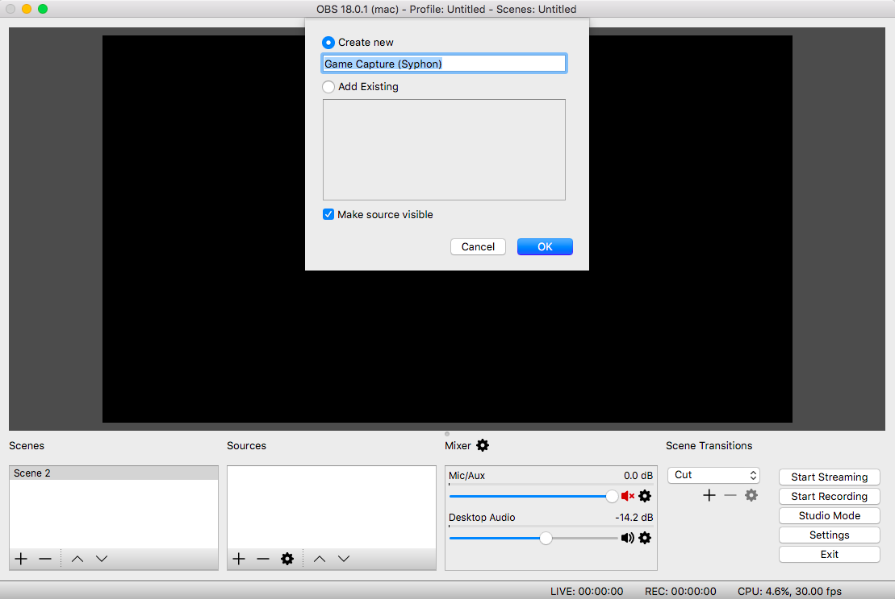
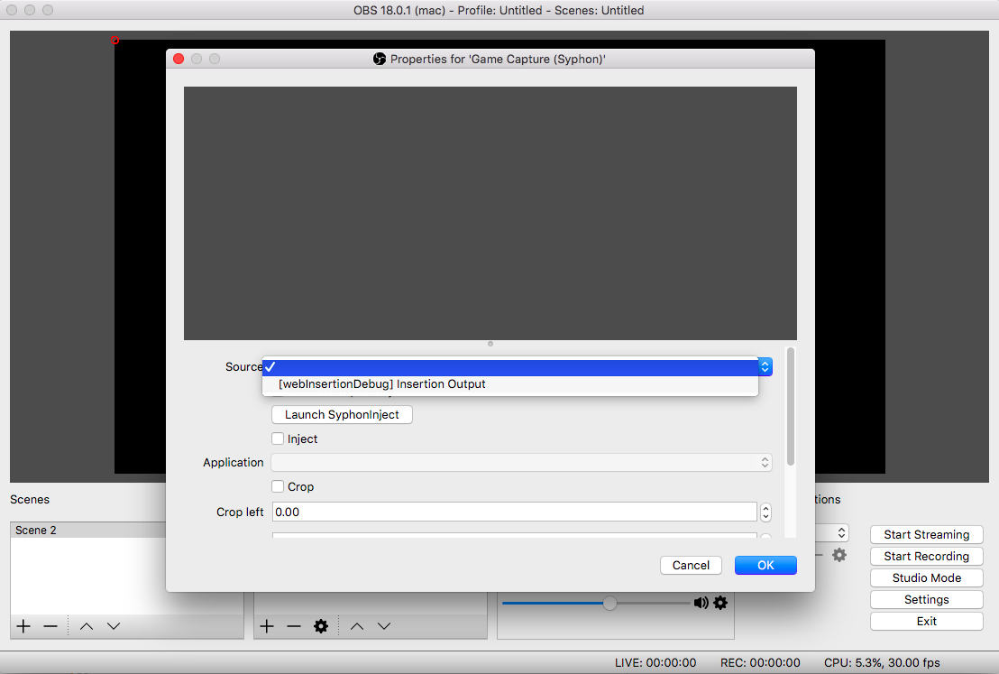
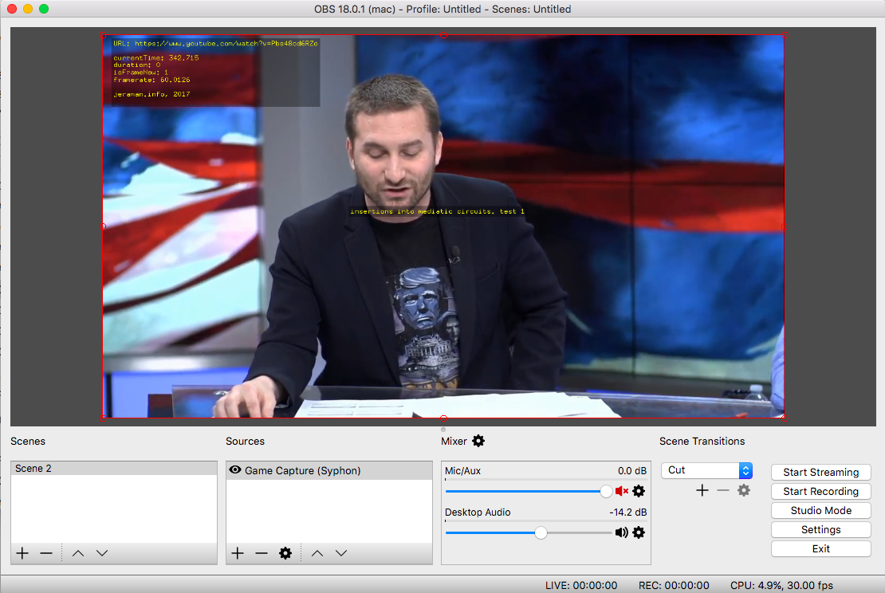

# Tutorial
This system is OS X-only and was tested in a OS X 10.11.6. Let me know if you ever test this in another version/distribution, I'd love to know!

## Dependencies
To start, we need to install the following software:
- [webInsertion software](https://www.dropbox.com/sh/iiwf8gqqzjp75fn/AAB8OtNXv44U7p0Vcwti85aOa?dl=0): Software that allows you to modify the incoming video using a friendly programming languages, as if it was a webcam. Make sure you download the right version for you platform (i.e. 32 or 64 bits). In addition, because this software is not Apple certified, there’s a chance you might have a security-related problem (*"this application is damaged and cannot be opened"* or something like that). In this case, follow [this link](http://osxdaily.com/2016/09/27/allow-apps-from-anywhere-macos-gatekeeper/) to solve the problem;
- [Youtube-dl](https://github.com/rg3/youtube-dl/): Command line tool that allows you to extract an m3u8 file from several resources, such as Youtube Live and others;
- [Open-broadcast software (OBS)](https://obsproject.com/): Software tool that allows you to broadcast videos to several services such as Youtube and Facebook Live;
- [Soundflower](https://soundflower.en.softonic.com/mac): Software tool that allows you to route whatever you're hearing in your speakers as a "virtual michrophone" to feed external software.

### Only for developers
If you are familiar with C++/Openframeworks, and want to modify the source-code by yourself, you're also going to need:
- openFrameworks ([version 0.9.8](http://openframeworks.cc/download/));
- xCode (get started on using xCode with openFrameworks [here](http://openframeworks.cc/setup/xcode/));
- The [webInsertion's source](https://github.com/jeraman/insertions/tree/master/osx/webInsertion).

...and install the following oF addons:
- https://github.com/jvcleave/ofxAvFoundationHLSPlayer
- https://github.com/astellato/ofxSyphon

If you're not a developer, nevermind. Just skip this step and go directly to the following subsection.

## Process
The image below summarizes the process. After selecting your video target (picture (a)), you will process it locally on openFrameworks and Obs (picture (b)). The result is going to be streamed back to whatever service you'd like, such as the youtube (picture (c)).



## Step 1: From the internet to your computer
In the beginning, you need to choose the live video stream you want to target. This video is represented in the picture above by (a). For example, you can go to the [Youtube Live](https://www.youtube.com/live), open the video you want to modify, and copy its URL.

Once you copied this URL, you only need paste it inside a text file called "video.txt". This file is placed inside the folder "data" that comes along with the webInsertion software you downloaded. As follows:



When you're done, you can open the webInsertion software you just downloaded. If you see the video playing, everything should be OK!



At any time, you can change the target video by modifying the "video.txt" and by clicking on "reload URL from file" inside the application.

If you're having problems, make sure you have picked a valid video, and that its link is correctly pasted into the "video.txt" file.

## Step 2: Modify it!
Now, it's time to modify the video!

For that, we are going to use the Open-broadcast software (OBS). A full tutorial is beyond the scope of this tutorial, you can find [several on youtube](https://www.youtube.com/watch?v=LX04mw_xG6A). It's enough to say here that it is: **open source** (i.e. free, and community driven), **powerful** (i.e. allows you to easily add images, sound, and other things to your video), and really **easy to use** (you can learn how to use only by trying it out).

This is how OBS should look like:



For this step, you'll need to configure both *video* and *audio*.

### Configuring video
To import your video inside OBS you'll need to:
1. Go to *"Sources"*, and click in *"+"*;



2. Click on *"Game Capture Syphon"*, and then on *"Create new"*;



3. Go in *"Source"* and choose *"[webInsertion] Insertion output"*. It's **essential** that the webInsertion app is up and running by them (see Step 1 if it's not);



4. By now, you should be seeing the video output inside OBS. That's great! You only need to adjust the size according to the output window provided by OBS.




### Only for developers
If you're confortable, you can play around with the video before sending it to OBS. Whenever you're draw in the screen before the call *"mainOutputSyphonServer.publishScreen()"* is going to get sent to OBS. Thus, for example:

```cpp
ofDrawCircle(150,150,100);
mainOutputSyphonServer.publishScreen();
```
In this first case, the circle will first be drawn in the screen that will be then sent to the Syphon stream. However, in the next example, the screen is sent to to Syphon first, and only later the circle  is drawn on the screen (i.e. the video in OBS won't contain the circle).

```cpp
mainOutputSyphonServer.publishScreen();
ofDrawCircle(150,150,100);
```
