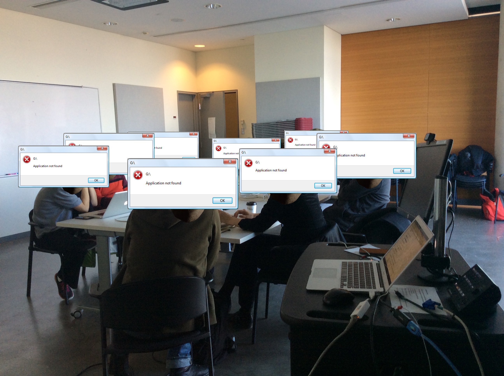
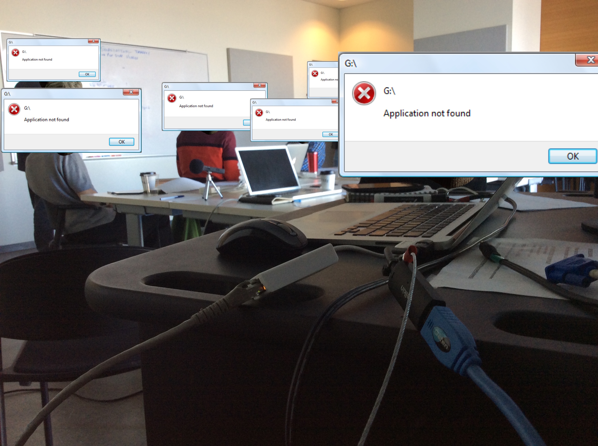
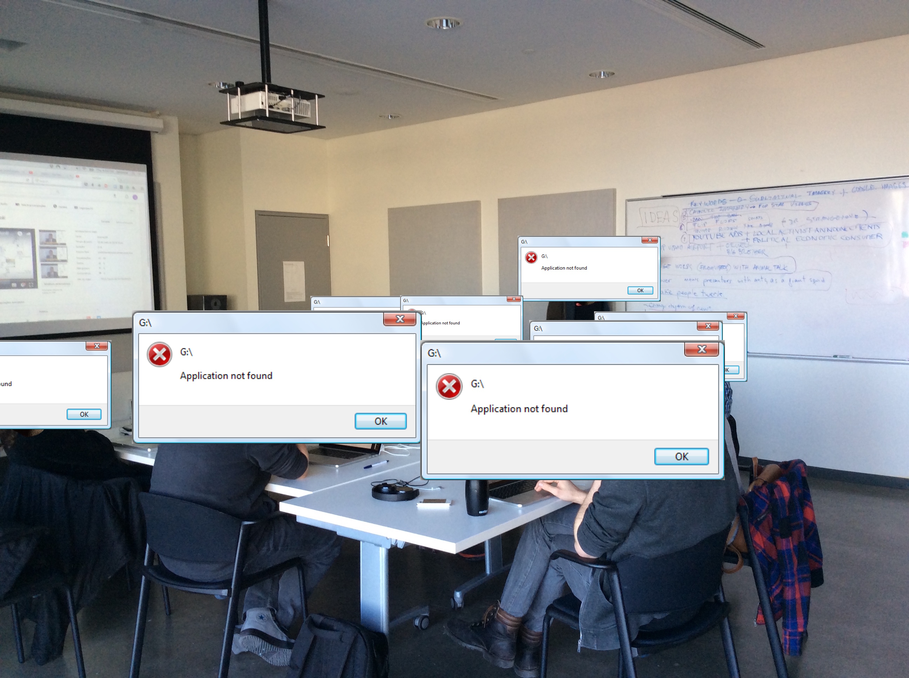

# 1 - Speculative Live Cluster Workshop

This was the first workshop of the _insertions_ project, performed after an invitation of the [Speculative Live](http://www.speculativelife.com) research cluster. The workshop happened around one month after the [bomb threat that targeted the Muslim community of Concordia University](http://www.cbc.ca/news/canada/montreal/montreal-concordia-university-bomb-threats-1.4006151).

**Local:** Concordia University, Montreal, Canada.

**Date:** Thursday, April 13 2017.

**Duration:** 4 hours.

**Link:** http://www.speculativelife.com/event/tools-for-activism-%E2%80%8Binsertions-into-mediatic-circuits/

## Result

## Photos

